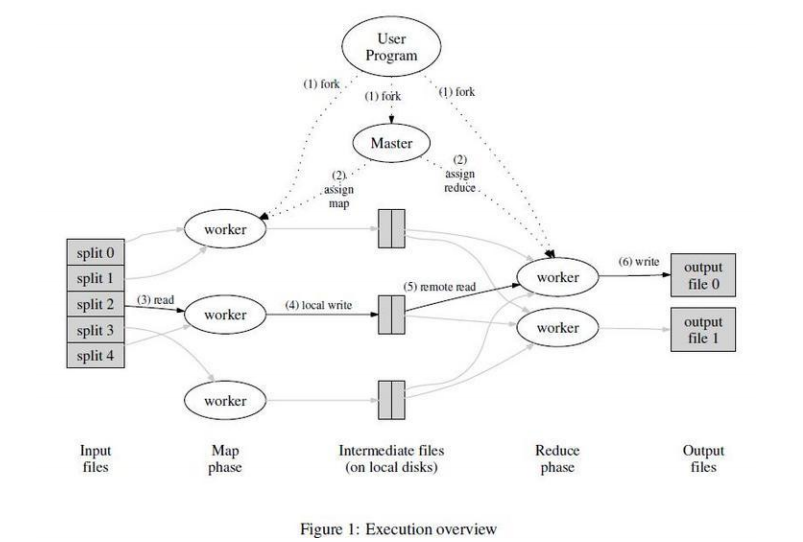

# MapReduce

### 介绍:

MapReduce是一种编程模型,也是一种处理和生成大量数据的实现

用户定义一个`map`函数用来处理键值对并生成中间键值对,定义一个`reduce`函数将相同中间键的中间值合并起来.

### MapReduce隐藏的"痛苦"细节:

+ 跟踪哪些任务完成
+ 数据移动
+ 从故障中恢复

### MapReduce可以很好地扩展:

N台电脑可以有N*x的吞吐量,`Maps()`是可以并行执行的,`Reduce()`也一样.所以可以通过加入更多的电脑来提高吞吐量.

### 可能影响性能的因素:

+ CPU
+ 内存
+ 网络
+ 硬盘

### 参考一个具体的实现:

+ 把Map调用的输入数据分割城M个数据片段的集合,输入的数据片段在多台机器上调用`Map`并行处理.
+ 通过分区函数(用户指定)把`Map调用`产生的中间`key`值分成R(用户指定)个不同分区(eg:hash(key) mod R),`Reduce`调用也是分布在多台机器上执行.

    

+ `MapReduce`实现的操作流程:

1. 用户程序调用`MapReduce库`将输入文件分成M个数据片段(16~64MB),然后程序在集群中创建大量程序副本.

2. 程序副本中有个特殊的程序`master`,副本中其他程序都是`worker`.由`master`将一个`Map任务`或`Reduce任务`分配给一个空闲的`worker`.

3. 被分配`Map任务`的`worker`将读取相关输入数据片段,从数据片断分解出`key/value键值对`传递给用户自定义的`Map函数`,`Map函数`处理并生成`中间key/value键值对`,缓存在内存中.

4. `分区函数`把缓存中的`中间key/value键值对`分成R个区域,周期性写入本地硬盘,然后将本地硬盘上的储存位置回传给`master`,由`master`将存储位置传送给`Reduce worker`.

5. `Reduce worker`接收到`master`程序发来的数据存储位置后,使用`RPC`从对应主机硬盘上读取这些中间数据,通过`key`进行排序.

6. `Reduce worker`遍历排序后的中间键值对,将每个不同的key值及其`value值集合`传递给用户自定义的`Reduce函数`,把输出追加到所属分区的输出文件.

7. 所有的`worker`都将任务完成后,`master`唤醒用户程序,MapReduce的调用才返回.

> 完成任务后,计算结果在R个输出文件中(对应每个`Reduce`任务尝试的一个输出文件).一般情况下用户不需要将R个输出文件合并成一个文件,而是用于另一个MapReduce的输入或者可以处理多个分割文件的分布式应用中使用.

### 如何做到负载平衡:

+ `Master`把新的任务分配给完成先前任务的`worker`,这样处理能力强的`worker`完成更多的任务.
+ 当`ReduceMap`操作快要接近完成的时候,`master`调度备用(backup)任务进程去执行那些处于处理状态中的任务(相当赛跑,看谁先完成).

### 怎样进行容错:

+ MapReduce要求`Map`和`Reduce`是输入确定性函数/pure function（即相同的输入产生相同的输出）
        
    + 不保存状态
    + 没隐藏通讯
    + 没有IO读写

+ worker故障:

    1. `Master`会周期性的ping每个`worker`,在某个约定时间内没有响应就会判断该`worker`失效.

    2. 这个`worker`已完成的`Map任务`(中间输出保存在故障机器上)和正在完成的任务将被标记为失效,安排给其他的`worker`执行.

+ master失效:

    `master`周期性将自身数据结构写入磁盘,建立一个检查点(checkpoint),若`master`任务失效了,就从最后一个检查点(checkpoint)开始启动另一个master进程.

### 什么应用程序MapReduce无法正常工作:

+ 不是所有东西符合 map/shuffle/reduce 模式:
    + 小数据,开销太大
    + 大数据的小更新
    + 不可预测的读取

### 总结: 

MapReduce使得大集群运算变得流行

- 它不是最有效或灵活的。
+ 扩展性好
+ 易于编程实现 -- 故障和数据移动是隐藏的

> 参考资料: 
> https://pdos.csail.mit.edu/6.824/notes/l01.txt 
> https://pdos.csail.mit.edu/6.824/papers/mapreduce.pdf