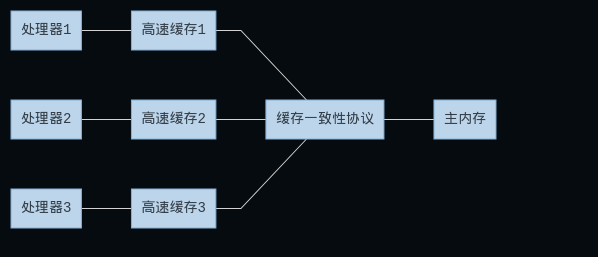
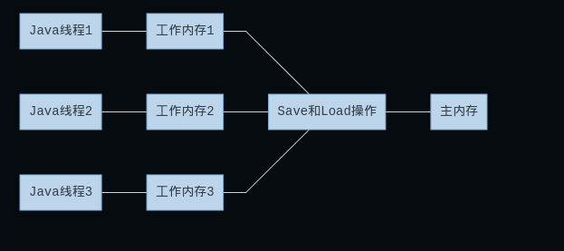

# Java内存模型

## 一. 基础(硬件效率的一致性):


1. 计算机内存模型:

    为了提高计算能力,减少计算机存储设备与处理器运算速度的差距,现代计算机系统在`内存`与`处理器`之间加入了一层读写速度与处理器运算速度尽可能接近的`高速缓存(Cache)`作为内存与处理器之间的缓冲.<br>
    将运算需要使用到的数据复制到缓存中,让运算能快速进行,当运算结束后再从缓存同步回内存中,这样处理器就无须等待缓慢的内存读写.
    

    


+ 这种模型虽然很好的解决了处理器与内存的速度矛盾,但却引入了`缓存一致性(Cahce Coherence)`的问题:

    多处理器系统中,每个处理器都有自己的高速缓存,它们共享同一块`主存(Main Memory)`.当多个处理器的运算都涉及同一块主内存区域时,可能导致各自的缓存数据不一致.
+ 为了解决一致性问题,需要各个处理器访问缓存时都遵循`一致性协议`,读写时根据协议进行操作


2. 处理器指令重排序:

    为了使处理器内部单元能被充分利用,处理器可能会对代码进行`乱序执行(Out-Out-Order Execution)优化`,处理器会在计算之后将乱序执行的结果重组,保证结果与顺序执行结果一致,但并不保证与输入代码的顺序一致.<br>
    + Java虚拟机的即时编译器中也有类似的`指令重排序(Instruction Reorder)`优化.


## 二. Java内存模型:

1. 内存模型中的关系(可与计算机内存交互关系类比):

    1. Java规定了所有的变量(`静态字段`,`实例字段`和`构成数组对象的元素`)都存储在`主内存`中.
    2. 每条线程拥有自己的`工作内存`,其中保存了该线程使用到的`主内存副本拷贝`.
    3. 线程对变量的所有操作(赋值,读取等)都必须在自己的工作内存中进行,而不能直接读写主内存中的变量.不同的线程之间也无法直接访问对方工作内存中的变量.<br>
    线程间的变量值传递均需要通过主内存来完成.

    

<!-- ```mermaid
graph LR;
处理器1 --- 高速缓存1


处理器2 --- 高速缓存2

处理器3 --- 高速缓存3

高速缓存1 --- 缓存一致性协议
高速缓存2 --- 缓存一致性协议
高速缓存3 --- 缓存一致性协议

缓存一致性协议 --- 主内存
``` -->

+ `主内存`主要对应于`Java堆`中的`对象实例`数据部分,`工作内存`则对应于`虚拟机栈`中的部分区域.<br>

    从更低的层次上说,`主内存`直接对应于`物理硬件的内存`,而为了获取更好的运行速度,虚拟机(甚至是硬件系统本身的优化措施)可能会让`工作内存`优先存储于`寄存器`和`高速缓存`中.


2. 内存间交互操作:

+ Java内存模型定义了8种操作(原子,不可再分)来完成主内存与工作内存之间的具体交互细节:

    lock(锁定): 作用于`主内存变量`,把一个变量标识为一条线程独占状态.
    
    unlock(解锁): 作用于`主内存变量`,把处于锁状态的变量释放出来.

    read(读取): 作用于`主内存变量`,把变量值从`主内存`传到线程的`工作内存`,以便`load`动作使用.

    load(载入): 作用于`工作内存变量`,把`read`操作从`主内存`得到的变量放入`工作内存`的`变量副本`中.

    use(使用): 作用于`工作内存变量`,把变量值传递给`执行引擎`.当虚拟机遇到需要使用变量值的字节码指令时会执行这个操作.

    assign(赋值): 作用于`工作内存变量`,把`执行引擎`的值,赋给`工作内存变量`.虚拟机遇到赋值的字节码指令执行此操作.

    store(储存): 作用于`工作内存变量`,把`工作内存变量`的值传送到`主内存`中.

    write(写入): 作用于`工作内存变量`,把`store`操作从`工作内存`得到的变量的值放入`主内存变量`中.

    + 把变量从`主内存`复制到`工作内存`: 顺序执行`read`和`load`.
    + 把变量从`工作内存`同步回`主内存`: 顺序执行`store`和`write`.<br>
    (顺序执行,不保证连续执行,可插入其他指令)


+ Java内存模型规定执行上必须满足以下规则:

    1. 不允许`read`和`load`,`store`和`write`操作之一单独出现.
    2. 不允许一个线程丢弃它的`assign`操作.
    3. 不允许线程无原因的(未发送`assign`)把数据从`工作内存`同步回`主内存`中.
    4. 新的变量只能在`主内存`中诞生.
    5. 一个变量同一时刻只允许一个线程对其进行`lock`操作,`lock`可被同个线程重复执行.
    6. 对一个变量进行`lock`操作,`工作内存`会清空此变量值,`执行引擎`使用这个变量之前,需重新执行`load`(主内存到工作内存)或者`assign`(执行引擎到工作内存)初始化变量值.
    7. 不允许`unlock`被其他线程`lock`或未被`lock`的变量.
    8. 对一个变量`unlock`之前,必须先同步(执行`store`,`write`)回`主内存`中.


3. volatile的特殊规则(有空另开一篇详细整理下):

    volatile是Java虚拟机提供的最轻量级同步机制.

+ 两种特性:

    1. 可见性: 保证volatile修饰的变量对所有线程可见.
        + volatile变量只能保证可见性,只能再一下场景使用:
            1. 运算结果不依赖当前值,或者能保证只有单一线程修改变量值.
            2. 变量不需要与其他的状态变量共同参与不变约束.

    2. 禁止重排序优化: 普通变量仅仅会保证该线程方法的执行过程中所依赖的赋值结果的地方都能获得正确结果.`volatile`能保证变量赋值操作顺序与代码中的执行一致.
        + 内存屏障(Memory Barrier/Memory Fence): 指`重排序`时不能把后面的指令重排序到内存屏障之前的位置.

+ volatile变量读操作性能消耗与普通变量几乎没差别,写操作开销比较大.


<!-- 3.内存屏蔽指令: -->


